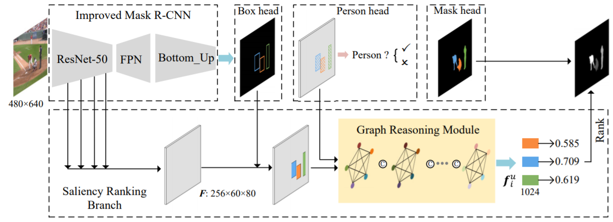

# Saliency-Ranking
Code release for the TPAMI 2021 paper "Instance-Level Relative Saliency Ranking with Graph Reasoning" by Nian Liu, Long Li, Wangbo Zhao, Junwei Han, and Ling Shao.



&nbsp;&nbsp;&nbsp;&nbsp;&nbsp;&nbsp;&nbsp;&nbsp;

## Installation
See [INSTALL.md](INSTALL.md).

&nbsp;&nbsp;&nbsp;&nbsp;&nbsp;&nbsp;&nbsp;&nbsp;

## Data Preparation
Download the datatset from [Baidu Driver](https://pan.baidu.com/s/1vzH_av0zCFhTL4WqpbTVmQ) (zsqn) or [Google Driver](https://drive.google.com/file/d/1R-S9yT0khNehAaA1M13N0AQGOicJS7uh/view?usp=sharing) and unzip them to './dataset'. Then the structure of the './dataset' folder will show as following:

````
-- dataset
   |-- Annotations
   |   |-- | train.pkl
   |   |-- | test.pkl
   |-- Images
   |   |-- train
   |   |-- |-- | image
   |   |-- |-- | gt
   |   |-- test
   |   |-- |-- | image
   |   |-- |-- | gt
````

&nbsp;&nbsp;&nbsp;&nbsp;&nbsp;&nbsp;&nbsp;&nbsp;

## Training model
1. Download the pretrained model from [Baidu Driver](https://pan.baidu.com/s/1O_3vCeruILrLcVkqnZauWQ)(spq9) or [Google Driver]() and put it into 'pre_model' foler.
2. Run 'python ./tool/plain_train_net.py'
## Testing model

