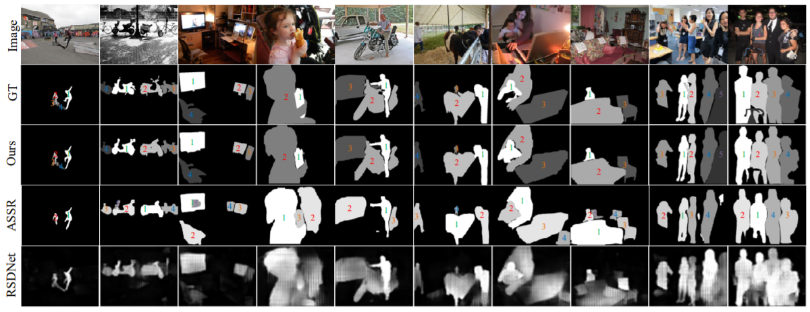

# Saliency-Ranking
Code release for the TPAMI 2021 paper "Instance-Level Relative Saliency Ranking with Graph Reasoning" by Nian Liu, Long Li, Wangbo Zhao, Junwei Han, and Ling Shao.


&nbsp;&nbsp;&nbsp;&nbsp;&nbsp;&nbsp;&nbsp;&nbsp;

## Installation
See [INSTALL.md](INSTALL.md).

&nbsp;&nbsp;&nbsp;&nbsp;&nbsp;&nbsp;&nbsp;&nbsp;

## Data Preparation
Download the datatset from [Baidu Driver](https://pan.baidu.com/s/1p8XVoBllw-re-fnynPodZA) (rx96) or [Google Driver](https://drive.google.com/file/d/1fp-LdlmTdoWsEK1jxP6VMjY-mJ1PhoQR/view?usp=sharing) and unzip them to './dataset'. Then the structure of the './dataset' folder will show as following:

````
-- dataset
   |-- Annotations
   |   |-- | train.pkl
   |   |-- | test.pkl
   |-- Images
   |   |-- train
   |   |-- |-- | rgb
   |   |-- |-- |-- | COCO_train2014_000000000110.jpg ...
   |   |-- |-- | gt
   |   |-- |-- |-- | COCO_train2014_000000000110.png ...
   |   |-- test
   |   |-- |-- | rgb
   |   |-- |-- |-- | COCO_val2014_000000000192.jpg ...
   |   |-- |-- | gt
   |   |-- |-- |-- | COCO_val2014_000000000192.png ...
````

&nbsp;&nbsp;&nbsp;&nbsp;&nbsp;&nbsp;&nbsp;&nbsp;

## Training model
1. Download the pretrained model (our modified Mask R-CNN model for salient instance segmentation) from [Baidu Driver](https://pan.baidu.com/s/1O_3vCeruILrLcVkqnZauWQ)(spq9) or [Google Driver](https://drive.google.com/file/d/1gyH89OVRzgvtVqyXr61y3qnGbEvwuosl/view?usp=sharing) and put it into `./model` folder.
2. Run `python ./tool/plain_train_net.py`. 
3. The trained model will be saved in `./output` folder. Additionally, the evaluaion results produced during training process will be saved    in `./output/SA_SOR.txt` and            `./output/MAE.txt`. 
## Testing model
1. Download our trained model from [Baidu Driver](https://pan.baidu.com/s/1otL_RvGaS1f91TsqvLg2ng)(fhz7) or [Google Driver](https://drive.google.com/file/d/1zBylV2C2BV_Is6yNQkNHCn4XIz27Xpr0/view?usp=sharing). Rename it as 'final_model.pth' and put it into `./model` folder.
2. Run `python ./tool/plain_test_net.py`.
3. The prediction images will be saved in `./prediction`.  And the metric score, **SA_SOR** and MAE, will be printed.


&nbsp;&nbsp;&nbsp;&nbsp;&nbsp;&nbsp;&nbsp;&nbsp;

## Result

The prediction results of our dataset can be download from [prediction](https://pan.baidu.com/s/1ysWXDwHhDU_MQZL8s8xt9Q) (k1jr).

## Metric
We propose a new evaluation metirc for this task, which comprehensively considers salient instance detection, segmentation, and ranking performance. See [SA-SOR](./metric).
